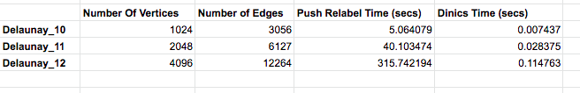
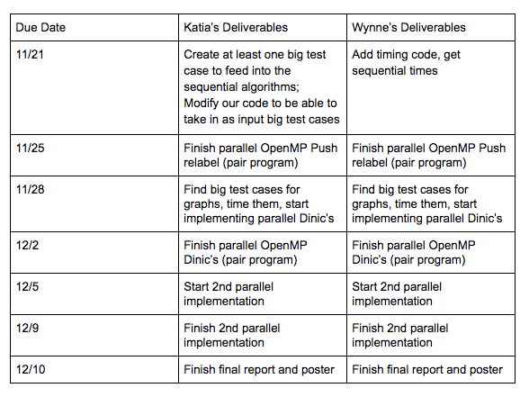
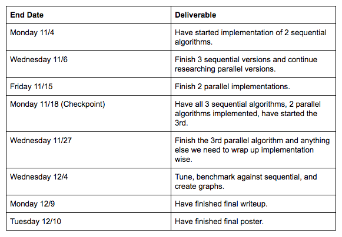

## Summary
We will be implementing sequential and optimized versions of the Dinic, Genetic and Push-Relabel algorithms for maxflow. We plan to parallelize the 3 algorithms with a shared-memory programming model. We will compare the performance and speedup of the parallelized versions relative to their sequential counterparts by running the algorithms on realistic graph workloads.

## Background
Applications of max flow include the project selection problem, image segmentation, airline scheduling, circulation-demand problem, and more. Because of the variety of problems that can be solved by finding a max flow through a network, we found this problem interesting. Furthermore, the benefits of optimizing max flow would lead to faster algorithms for other real world problems.

## Challenge
The most common challenge that researchers faced when implementing parallel graph algorithms is a lot of existing max flow algorithms are sequential by nature, making parallelism a challenge. Also, graph problems are often memory bandwidth bound because of the rather random accesses of memory. Furthermore, because of this bound on bandwidth, there is a low computation to communication ratio, making it a difficult problem on which to optimize performance. One challenge would be to figure out some way to access memory such that there is greater locality (i.e., avoiding having a large amount of page faults or cache misses by using sharding).

## Resources
We will need a 16-core hyper-threaded CPU, probably by using an AWS EC2 instance, so we would need credit for this. We will not use any existing codebases, but will use the pseudocode for the algorithms from GeeksforGeeks articles as well as from these following papers: Munakata & Hashier [1] for the genetic algorithm and Baumstark Blelloch and Shun [2] for Push Re-label. We plan to use the evaluation workload used in Baumstark et. al.’s paper to evaluate our parallel and sequential implementations on realistic input graphs.

## Platform Choice
The machines that we are planning to use are an 8-core CPU, a 16-core CPU and possibly a GPU. The workload we plan to use for evaluating our parallel algorithms will be the same as the ones used in the Baumstark et. al.’s paper which was evaluated on 2-32 threads. Since, many times graph algorithms are memory bandwidth bound we are also thinking of implementing some our parallel algorithms in CUDA to run them on higher memory bandwidth GPUs. We plan to implement the sequential and parallel algorithms in C++ since we will have access to parallelization libraries like OpenMP.

## Goals and Deliverables
What we plan to achieve is to parallelize the 3 algorithms and get a significant speedup over the sequential versions. We also want to generate graphs comparing them to each other and to existing implementations. 
If we finish our initial plan with enough time to spare, then a further goal that we hope to achieve would be to implement the parallel algorithms in a different programming model (i.e. MPI), use different optimized data structures in our algorithms (i.e. dynamic trees for Dinic’s), explore fine-grained locking, and/or try lock free implementations and compare their speedups as well. 
We will mainly be showing the performance of our implementations on a realistic workload and speedup graphs, comparing our sequential and parallel implementations, as our results during our demo. 

# Checkpoint

## Work Completed So Far
We have implemented the 2 sequential algorithms and have a detailed understanding of how to proceed with parallelizing push-relabel. Additionally, we have a sequential implementation of the Genetic Algorithm for solving the max flow problem, that we have ready to use for one of our reach goals. We have also tested and collected timings on our two sequential algorithms on large Delaunay graph test cases (up to 4096 vertices and 12264 edges). 

## Prelimenary Results
We tested our sequential implementations on a few medium sized, delaunay graphs with the number of edges ranging from 3056 to 12264. We used delaunay graphs since these were the graphs used in the Blelloch paper and ultimately we want to compare our results to this paper’s. It appears as though Dinics performs pretty well on medium sized graphs, which makes sense since Dinic’s is an optimized sequential maxflow algorithm. Push-relabel on the other hand seems to struggle with larger sized test cases, with a time of almost 5 minutes for the graph with 12k edges. We predict the reason for this is because push-relabel is inherently parallelizable so we will see benefits of the implementation once we add parallelization to it. 

## Updated Goals
We plan to create sequential and parallel versions of 2 commonly used maxflow algorithms - Push-Relabel and Dinic’s - and attempt to get significant speedup for the parallel versions. We plan to implement initial parallel versions of Push-Relabel and Dinic’s using OpenMP and at least one other parallel implementation for each (i.e. CUDA, MPI or using the C++ Thread Building Block Library). We plan to test our implementations on a large benchmark of DIMAC-formatted graphs, used in Blelloch’s paper, to evaluate our sequential and parallel implementations on real-sized graphs. If we finish our initial plan with enough time to spare, then a reach goal that we hope to achieve would be to either add a sequential and parallel version of a Genetic Algorithm for maxflow or use different optimized data structures in our algorithms (i.e. dynamic trees for Dinic’s), explore fine-grained locking, and/or try lock free implementations and compare their speedups as well. 

## Updated Schedule

## Old Schedule

