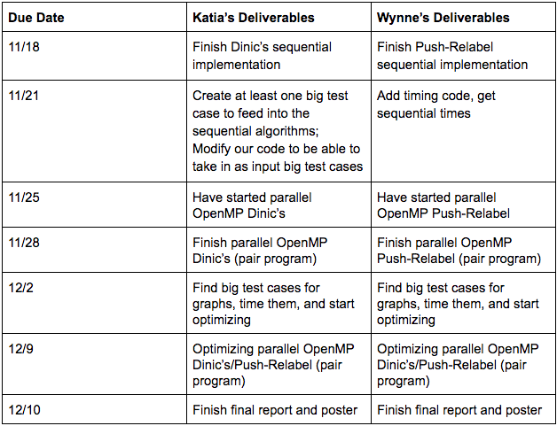
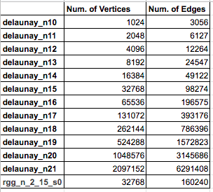
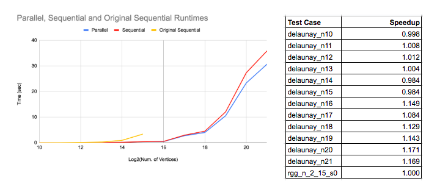
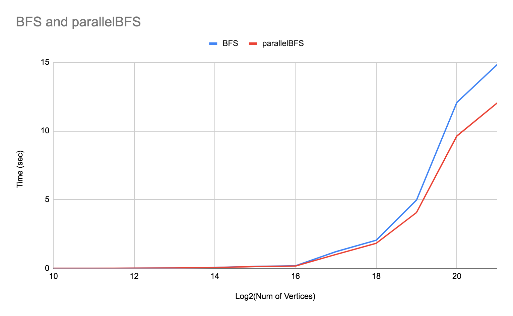
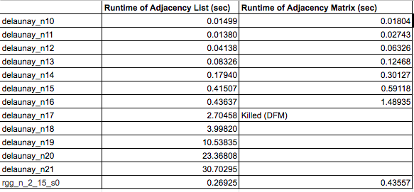
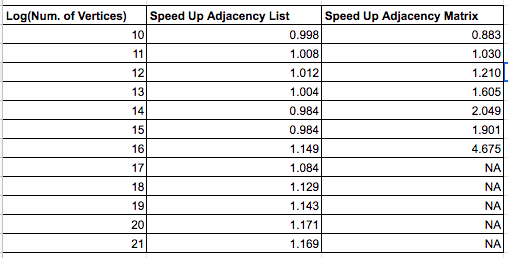
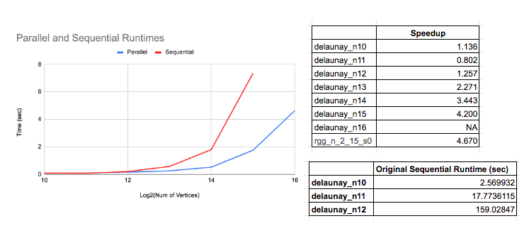
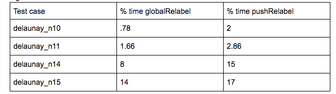

## Summary
Our project focused on parallelizing and evaluating the performance of two commonly used algorithms for solving the maximum flow problem on graphs, Dinic’s and Push-relabel. We created sequential and shared-memory (OpenMP) parallel versions of the algorithms. To enhance the performance of the parallel algorithms, we also integrated lock-free updates to certain variables and concurrent data structures (using the thread building block library in C++). Our evaluation of the algorithms involved running the algorithms on realistically-sized graphs and comparing the speedup of the parallel implementation to the sequential.  
You can find our final paper [here](https://docs.google.com/document/d/1_dfUpSdmUni91AaYEJRZ0LUOZwGeUtZY3ZUYwjEe1kA/edit?usp=sharing) and the code [here](https://github.com/KatiaVi/418MaxFloProject). 

## Background
Applications of max flow include the project selection problem, image segmentation, airline scheduling, circulation-demand problem, and more. Because of the variety of problems that can be solved by finding a max flow through a network, we found this problem interesting. Furthermore, the benefits of optimizing max flow would lead to faster algorithms for other real world problems.

## Challenge
The most common challenge that researchers faced when implementing parallel graph algorithms is a lot of existing max flow algorithms are sequential by nature, making parallelism a challenge. Also, graph problems are often memory bandwidth bound because of the rather random accesses of memory. Furthermore, because of this bound on bandwidth, there is a low computation to communication ratio, making it a difficult problem on which to optimize performance. One challenge would be to figure out some way to access memory such that there is greater locality (i.e., avoiding having a large amount of page faults or cache misses by using sharding).

## Resources
We will need a 16-core hyper-threaded CPU, probably by using an AWS EC2 instance, so we would need credit for this. We will not use any existing codebases, but will use the pseudocode for the algorithms from GeeksforGeeks articles as well as from these following papers: Munakata & Hashier [1] for the genetic algorithm and Baumstark Blelloch and Shun [2] for Push Re-label. We plan to use the evaluation workload used in Baumstark et. al.’s paper to evaluate our parallel and sequential implementations on realistic input graphs.

## Platform Choice
The machines that we are planning to use are an 8-core CPU, a 16-core CPU and possibly a GPU. The workload we plan to use for evaluating our parallel algorithms will be the same as the ones used in the Baumstark et. al.’s paper which was evaluated on 2-32 threads. Since, many times graph algorithms are memory bandwidth bound we are also thinking of implementing some our parallel algorithms in CUDA to run them on higher memory bandwidth GPUs. We plan to implement the sequential and parallel algorithms in C++ since we will have access to parallelization libraries like OpenMP.

## Goals 
What we plan to achieve is to parallelize the 2 algorithms and get a significant speedup over the sequential versions. We also want to generate graphs comparing them to each other and to existing implementations. We plan to test our implementations on a large benchmark of DIMAC-formatted graphs, used in Blelloch’s paper, to evaluate our sequential and parallel implementations on real-sized graphs.
If we finish our initial plan with enough time to spare, then a further goal that we hope to achieve would be to implement the parallel algorithms in a different programming model (i.e. MPI), use different optimized data structures in our algorithms (i.e. dynamic trees for Dinic’s), explore fine-grained locking, and/or try lock free implementations and compare their speedups as well. 

## Schedule 

# Algorithm Descriptions 

## Dinic’s
Dinic’s algorithm is made up of 2 main steps:
(1) BFS: Labels each vertex of the residual graph with its shortest distance from the source node (i.e. the level of the node). 
(2) sendFlow: Pushes as much flow as possible from the source node to a neighboring 1st level node, then from the 1st level node to a neighboring 2nd level node … until the flow reaches the sink node of the residual graph. It repeats this process pushing as much flow from the source as possible.
These two steps are repeated until the BFS returns false because the sink node is unreachable from the source node in the residual graph at which point maximum flow has been pushed from the source to the sink.

## Push-Relabel
The original serial version of push-relabel involves first sending out a preflow, which initially sends out flow equal to the capacities of the edges from the source to the source’s neighbors. Vertices in push-relabel have heights. These heights reflect how far away from the sink the vertex is. Each vertex can also have an excess amount of flow. Vertices that have nonzero excess flow are called active vertices. From the active set, a vertex is chosen. It can only push onto its neighbors that have a height 1 less than its own height. We call the edge between the active vertex and such a neighbor an admissible edge. If the active vertex doesn’t have any neighbors on which to push, the vertex’s height will be relabeled to be the minimum of its neighbors heights plus 1 (so that the next round, it can push somewhere). The active vertex set updates according to the updated flows, and this process continues until there are no more active vertices. The output is the amount of excess flow the sink has.  

We based our parallel implementation off of the paper by Baumstark, et. al. The parallel high level algorithm involves first doing the preflow, same as before. For one iteration, the active vertices are processed in parallel and possible pushes are performed. Each of the active vertices has most if not all of its excess flow pushed out in one iteration. However, the modified excess flows are saved separately and not applied until the end. New labels are computed in parallel but not applied until the end of the iteration. At the end of processing all the active vertices, the new labels and the new excess changes are applied and a new active set is created before the next iteration. After a few iterations, a global relabel is called, which uses a reverse BFS to assign the vertices heights that mirror their distances from the sink again. If the working set is empty, the algorithm stops and outputs the sink’s excess flow as the max flow. 

# Checkpoint

## Work Completed So Far
We have implemented the 2 sequential algorithms and have a detailed understanding of how to proceed with parallelizing push-relabel. Additionally, we have a sequential implementation of the Genetic Algorithm for solving the max flow problem, that we have ready to use for one of our reach goals. We have also tested and collected timings on our two sequential algorithms on large Delaunay graph test cases (up to 4096 vertices and 12264 edges). 

## Preliminary Results
We tested our sequential implementations on a few medium sized, delaunay graphs with the number of edges ranging from 3056 to 12264. We used delaunay graphs since these were the graphs used in the Blelloch paper and ultimately we want to compare our results to this paper’s. It appears as though Dinics performs pretty well on medium sized graphs, which makes sense since Dinic’s is an optimized sequential maxflow algorithm. Push-relabel on the other hand seems to struggle with larger sized test cases, with a time of almost 5 minutes for the graph with 12k edges. We predict the reason for this is because push-relabel is inherently parallelizable so we will see benefits of the implementation once we add parallelization to it. 

## Approach to Parallelization
### Dinic's
Our original sequential implementation of Dinic's represented the capacities and flows as adjacency matrices which is why after running the performance analysis we found that the initialization step was actually the hotspot (with over 75% of the execution time being spent in this step). So the first step was to parallelize this function by separating the updates to the flows in a way that no two threads would try to update the same place in the matrix twice. This improved performance significantly but for graphs with larger sized nodes, the function initialize continued to be the main source of contention. An additional problem we faced is that since Dinic's was relatively fast on the test cases that could be stored in memory (i.e. graphs with up to 2^16 nodes) it was hard to see any interesting results for the parallel version. 
To run Dinic's on larger test cases and focus parallelization on the main parts of Dinic's algorithm, like the BFS function, we changed the input (capacities/edges) and output (flows) to Dinic's to be adjacency lists rather than matrices. As a result we could now test the algorithm on much larger test cases, up to 32 times larger, and the newer bottlenecks were now in the sendFlow and BFS functions. Additionally, using adjacency lists improved performance of both the sequential and parallel algorithms significantly.  Adding a parallel BFS with bags, improved performance on larger tests cases, but this was not immediately clear as the parallel BFS seemed to hurt the smaller test cases. We also tried to add a concurrent container for the parallelBFS since the order of the vertices in the vector at a level does not matter, however we had issues getting this idea to work with OpenMP tasks, perhaps because the tasks were generated recursively. Finally, we also tried smaller optimizations like parallelizing the search in the adjacency list for a specific flow in the sendFlow and BFS functions (using a C++ parallel algorithms library). However, this did not help performance either probably because the max out-degrees of the graphs we tested on were fairly small. 

### Push-Relabel
Having finished writing the parallel code based off of the paper, we ran a perf report for hotspots and saw that a significant bottleneck was in PushRelabel (around 35%) because of the slow n^2 time update of the residual capacities before the start of the next iteration. To fix this, we instead only updated the residual capacities of the vertices that had been in the working set and the vertices that those active ones had pushed to during the iteration. We could then combine this step with a preexisting loop that looped through the working set to add the excess changes and relabel the nodes. We also moved the initialization of the residual capacities from its own for loop to one that was already going to be performed in the preflow. 

After correcting that bottleneck and running perf again, we saw that the bottleneck was now in the globalRelabel step. Around 93% of the time was spent on traversing the residual array column-wise. The traversal was column-wise because we needed to check the nodes v that were, for instance, going to the sink w that had non zero residual capacities; so we needed to know for all v, if residual[v][w] was non-zero. This column-wise traversal caused a lot of cache misses and made the process slow. Thus, we created a reverseResiduals vector such that reverseResiduals[w] would contain all the residuals from nodes v to w. This significantly drove down the amount of time that was spent on that line.  

Next, we noticed that a lot of the time, we’re not able to add for instance, a parallel for, when looping over a set or a vector that had threads pushing to it, since, without a lock, this would cause correctness issues. Thus, we tried using tbb concurrent vectors in order to be able to correctly push back onto a frequently-used vector like discoveredVertices and have it be less of a bottleneck. We also originally made discoveredVertices a 2D matrix, but this was quite slow and could have potentially caused a lot of false sharing. Instead, we changed discoveredVertices to be a vector of concurrent vectors, or essentially an adjacency list. 

One thing we struggled with was changing the algorithm from the iterative version to the parallel one, since we had to figure out what could be updated during the iterations as opposed to being saved to update at the end of each iteration. For instance, we couldn’t check whether there was an edge from vertex i to j in the residual graph within the iteration by checking cap[i][j] - flows[i][j] since flows[i][j] could change. Instead, we realized we needed to save the residual capacities before and after each iteration and use those to check if there was an edge in the residual graph between two vertices. Additionally, after adding OpenMP, we also had to figure out which places required atomic fetch-and-adds or compare-and-swaps (as opposed to having one large lock), such as atomically fetching and adding to the added excess vertex since multiple vertices could be neighbors to that vertex and be pushing flow to it. 

## Results 
### Performance Metrics
We evaluated our parallel algorithms by comparing their wall-clock times (in seconds) and speedup to their sequential counterparts. Specifically, we ran the command “numactl --physcpubind=0” with our parallel versions to see their sequential times and used that time in our speedup calculation. 

### Performance Benchmark Used
Our benchmark consists of primarily delaunay graphs of various sizes, to see interesting trends in scaling our algorithms, and an additional rgg graph, to model our algorithms on different types of graphs. The choice of these types of graphs was inspired by the benchmark of graphs used by Baumstark Blelloch and Shun [2] in their evaluation of their push-relabel parallel algorithm. Both delaunay and rgg graphs also have interesting real-world applications as delaunay graphs are used to construct mesh models of objects and rgg graphs are used in modelling wireless connection networks. The table below shows the complete list of graphs that were used in the benchmark and their properties:

The delaunay graphs that we retrieved were from the 10th DIMACs Implementation Challenge website (https://www.cc.gatech.edu/dimacs10/archive/delaunay.shtml) and the rgg graph was retrieved from the Karlsruhe High Quality Partitioning website (http://algo2.iti.kit.edu/documents/kahip/index.html). These graphs had to be converted to a specific DIMACs instance of the maxflow problem before being read by our parser. We randomly generated capacities for each of the edges in these graphs with maximum capacity being 1000. 

### Experimental Setup
For Dinic's we performed the following experiments:

1. Parallel vs Sequential Times and Speedup
2. BFS vs parallelBFS
3. Adjacency List vs Adjacency Matrix

For Experiment 1, we ran each test in the benchmark 3 times on the parallel Dinic’s algorithm (with adjacency lists) and took the average of the 3 trials. For graphs with the number of nodes less than 2^16, we ran Dinic's with the regular BFS. For graphs with the number of nodes >= 2^16, we ran Dinic's with the parallel BFS, since at this point, the data showed that the parallel BFS resulted in a better runtime than the regular BFS. To determine the speedup for this experiment we compared the runtime of the parallel Dinic’s algorithm on a single thread. We also included the times using the original sequential algorithm.

For Experiment 2, we ran each test in the benchmark 3 times on the parallel Dinic’s algorithm (with adjacency lists) with the regular BFS and the parallel BFS, recording the average time spent in the BFS function over the 3 trials.

For Experiment 3, we ran each test in the benchmark 3 times on the parallel Dinic’s algorithm using adjacency lists, taking the average over the 3 trials. For the parallel Dinic’s algorithm using adjacency matrices we ran the tests from the benchmark that could fit in memory. Like in experiment 1, we calculated the speedup of each algorithm by comparing its parallel runtime to the single thread runtime.

For Push-relabel, we only performed the Parallel vs Sequential Times and Speedup experiment. Like for Dinic’s, we ran all the tests from the benchmark that fit into memory 3 times and took the average of the 3 trials. To determine the speedup we compared the runtime of the parallel algorithm to the runtime of the algorithm run on a single thread. We also included the times using the original sequential push-relabel algorithm.

### Results for Experiment 1: Parallel vs Sequential Times and Speedup
The graph below shows the runtimes of the Parallel Dinic's algorithms, Parallel Dinic's algorithm ran on a single core (i.e. Sequential) and the Original Sequential algorithm. Although the parallel version’s runtime does appear to be smaller than the sequential’s, especially on graphs with more than 2^17 nodes, the speedup table indicates that the speedup isn’t significant given the number of cores. 

### Results Experiment 2: BFS vs parallel BFS
The main function of Dinic's that we tried parallelizing is the BFS function. Below is a graph of the runtime of the parallel Dinic's algorithm (where the graph is represented with adjacency lists) when ran with the regular BFS and the parallel BFS with bags. It appears as though BFS and parallelBFS have around the same performance for a smaller number of nodes. In fact, the regular BFS performs better when the number of nodes is smaller perhaps due to the added complexity of recursion in the parallelBFS. However, when the number of nodes hits 2^18 we can see that the parallelBFS begins to outperform the regular BFS. Note that we used a cutoff of 128 to determine when to split the vector of nodes into halves.

### Results Experiment 3: Adjacency List vs Adjacency Matrix
The table below demonstrates that although adjacency matrices achieved reasonable speedup on graphs where the number of nodes was 2^16, the machine could only fit graphs with up to that many nodes in memory. From the other table, it appears as though adding adjacency lists improved the runtime of Dinic's on both single and multiple threads which as a result reduced the speedup. Adjacency lists also allowed parallel Dinic's to be run on all the test graphs in the benchmark.

### Analysis of Dinic's Results
From experiment 1 we see that the speedup of the final parallel Dinic's is not very significant. Most likely this is due to the fact that a significant portion of the algorithm, the sendFlow function, is inherently parallel and recursive. The sendFlow bottleneck became more apparent after running performance reports on larger test cases, starting from graphs with 2^16 nodes. For these test cases, no matter which BFS algorithm was used, sendFlow consistently comprised between 18 to 25% of the execution time. 

### Speedup and Times for Push-relabel

### Analysis of Overall Speedup and Times for Push-relabel
Here were some of the percentages of time spent in the two major parts of the push-relabel algorithm. 

In the perf report of the delaunay_n11 test case, the majority of the time was spent in neither globalRelabel nor pushRelabel, but rather in a library called libgomp, which is something that OpenMP uses to manage threads. Perhaps to get a better speedup on smaller test cases, we might need to switch to using a different parallel framework to avoid this overhead. 

We speculated that one thing that is limiting speedup is the fact that the algorithm is still inherently iterative - each iteration concatenates together the new working set before the next iteration, thus the iterations have dependencies between each other. Another speculated limiter is false sharing because of the large 2D matrices we use. Instead, they could be replaced with adjacency lists. Furthermore, the working set could be made into a concurrent unordered set as well. We also saw that 49% of the execution time was spent in globalRelabel to check that residual[v][w] > 0, and if so, pushing v onto reverseResiduals[w]. This had to be done in a critical section, as multiple threads could be pushing onto w’s vector. Lastly, we know that there is also synchronization overhead from mfence - in the perf report for delaunay_n14, we see that mfence is taking up 32% of the execution time. As we did not explicitly put in an mfence, this mfence is probably due to the synchronization used in the OpenMP commands. It is possible that this indicates that the section before the mfence took a long time, not the mfence itself. However, after looking more closely, the sections before the mfence involve simple loads and additions, so this is probably not the case. 

## References
* Niklas Baumstark, Guy Blelloch, and Julian Shun. 2015. Efficient implementation of a synchronous parallel push-relabel algorithm. In Proc. ESA.
* Udacity. “Finishing the Parallel BFS with Bags” YouTube, 23 Feb. 2013, https://www.youtube.com/watch?v=M4HSekx-8XA
* Wikipedia contributors. "Maximum flow problem." Wikipedia, The Free Encyclopedia. Wikipedia, The Free Encyclopedia, 29 Nov. 2019. Web. 10 Dec. 2019.
* Nishant Singh. “Dinic’s Algorithm for Maximum Flow ” Geeks for Geeks. https://www.geeksforgeeks.org/Dinic's-algorithm-maximum-flow/
* 2013 Lecture 14: 15-451/651: Design & Analysis of Algorithms, lecture notes,School of Computer Science 15-451, Carnegie Mellon University, 10 Oct 2013. https://www.cs.cmu.edu/~avrim/451f13/lectures/lect1010.pdf
* Wikihow, WikihowLearn, “Course:Concurrent Programming in CPP” Wikihow, https://en.wikitolearn.org/Course:Concurrent_Programming_in_CPP/TBB_Containers/TBB_Containers
* 2016 Lecture 12: 15-451/651: Network Flows I, lecture notes,School of Computer Science 15-451, Carnegie Mellon University, 22 Feb 2016. http://www.cs.cmu.edu/afs/cs/academic/class/15451-s16/www/lectures/lec12-flow1.pdf
* M. Holtgrewe, P. Sanders, and C. Schulz. Engineering a Scalable High Quality Graph Partitioner. 24th IEEE International Parallel and Distributed Processing Symposium, 2010.

